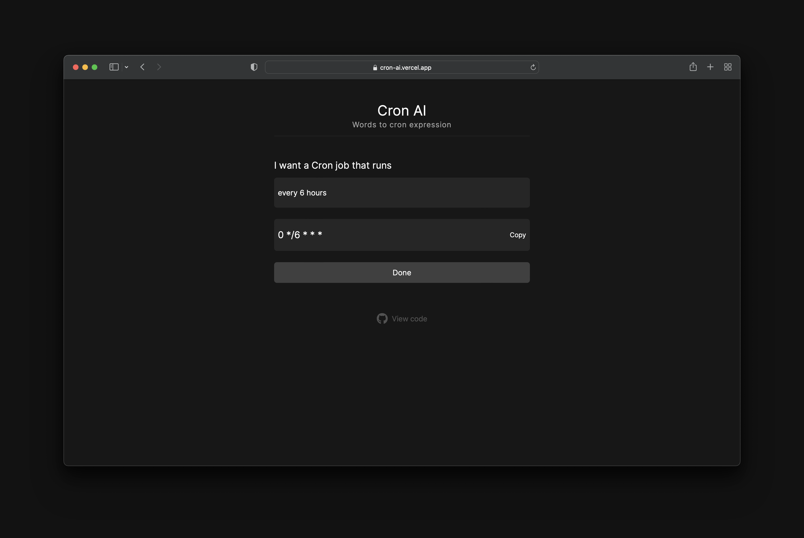

## Cron AI

Words to cron expression, using AI

[](https://rodgetech.com/)

## How it works

To generate cron expressions, this project uses OpenAI's [text-davinci-003](https://platform.openai.com/docs/models/gpt-3-5)  model.

## Running locally

### Create a OpenAI account to get API key.

1. Visit [OpenAI](https://platform.openai.com/signup) to create an account.
2. Click [here](https://platform.openai.com/account/api-keys) to get your API key.

### Storing API keys in .env.local

Create a `.env.local` file in the root of the project. And store your API key in it, as shown in the `.env.local.example` file.

### Install dependencies:

```bash
pnpm install
```

### Run the dev server:

```bash
pnpm dev
```

Open [http://localhost:3000](http://localhost:3000) with your browser to see the app running.
