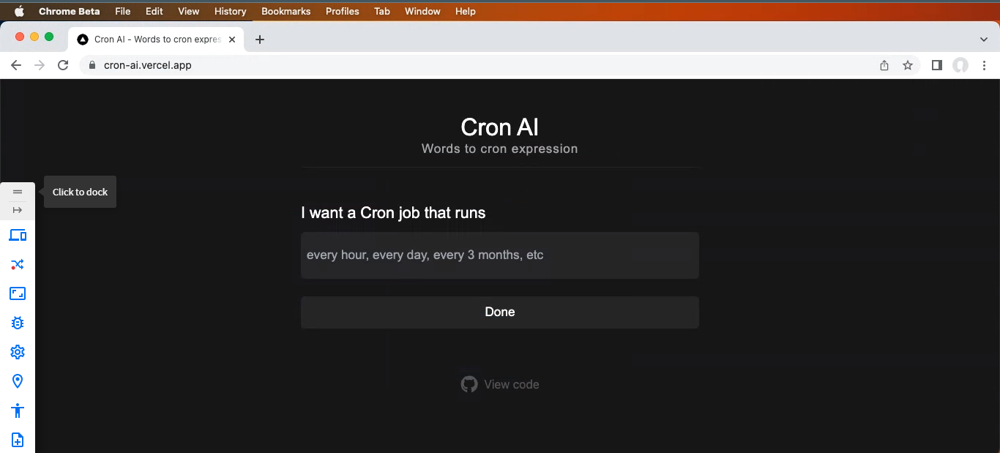

# Cron-AI

Introducing the AI Cron Job Code Generator - a cutting-edge app that uses advanced AI algorithms to generate optimized cron job codes in seconds. 
## Screenshots




## Run it on your local machine

First of all just clone this repo 

For Windows

```bash
  git clone https://github.com/rodgetech/cron-ai.git
```

For Linux and MacOS
```bash
 sudo git clone https://github.com/rodgetech/cron-ai.git
```

Run the Dev Server for Instant Openign
```bash
 npm run dev
```
OR
```bash
 yarn run dev
```

OR
```bash
 pnpm run dev
```
## FAQ

#### How can I contribute?

Just raise an issue in which you're looking to work. Ask us to assign you and you will get assigned on that issue. 


## Thank You So Much for Making it till the end ❤️❤️

